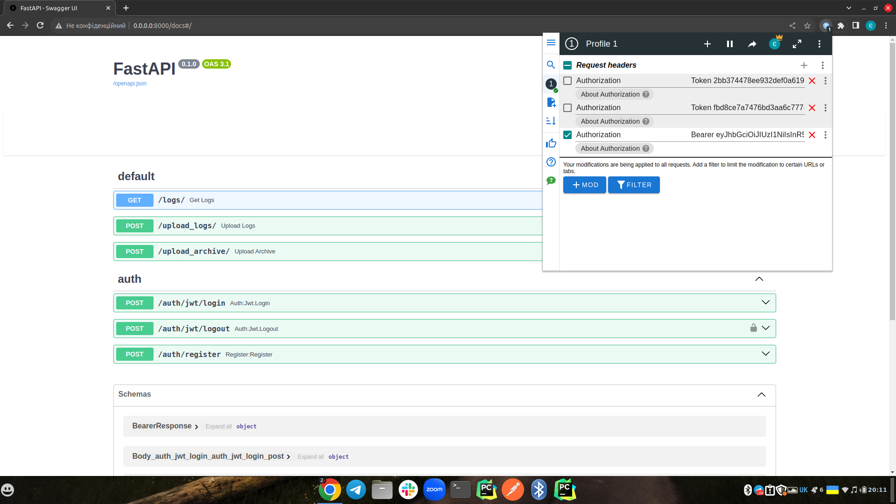
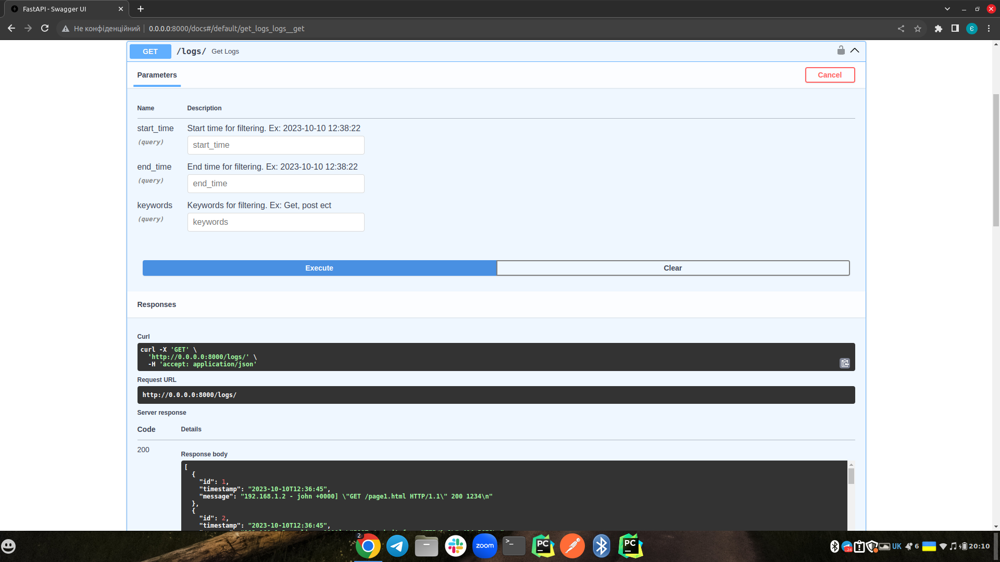
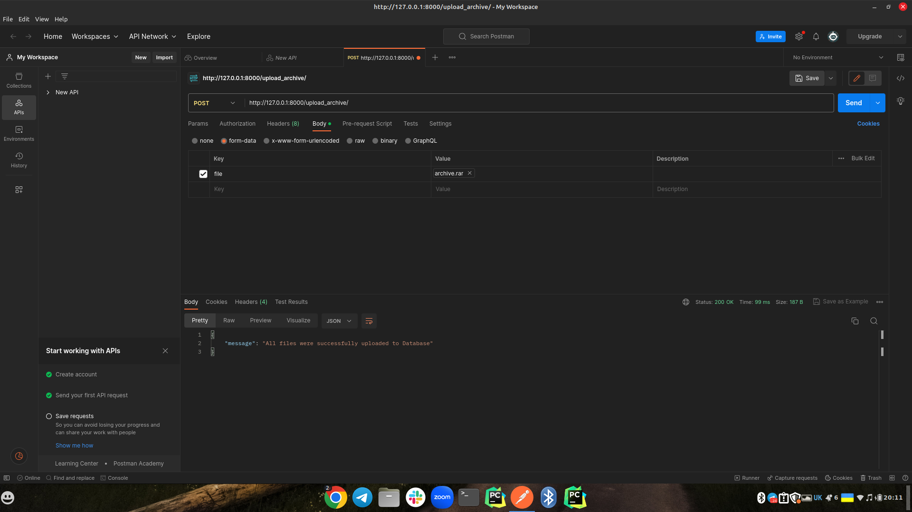
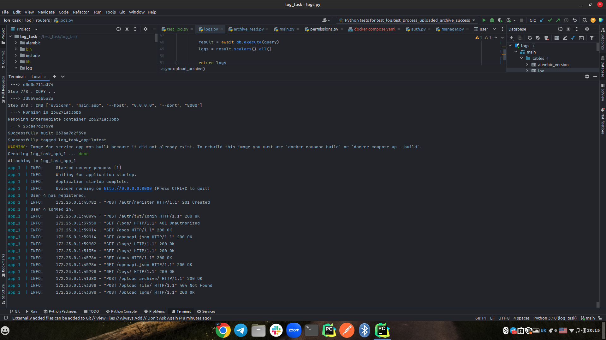

Accepting logs in the form of text files or zip archives, with architectural support for handling various types of archives.

Here is a brief explanation of what each endpoint in the code does:

1. /logs/ - It retrieves all recorded logs from the database, and also allows filtering by date, keywords, or a combination of both (available only for registered users).
2. /upload_logs/ - Allows uploading log files, processes, and stores them in the database. Available only for the following log file formats: Common Log Format (CLF), W3C Extended Log Format, Apache NCSA Log Format.
3. /upload_archive/ - Allows uploading an archive containing log files and processes them. Supported archive formats include: zip, rar, 7z, tar, xz, gz, bz2.


## Installation

Python3 must be already installed


```shell
git clone https://github.com/evgenijmartynuk07/log_task.git
cd log_task

python -m venv venv
source venv/bin/activate

create .env based on .env.sample

run: docker-compose up
```


### 1. screenshots:



### 2. screenshots:



### 3. screenshots:



### 4. screenshots:

